# How to install Home Assistant on Debian 14 "Forky" with QEMU/KVM virtual image

It's been a tough learning path for me, so I decided to create this tutorial and spare you all that effort.<br>
In this tutorial I will use an old Intel x86 PC as a Home Assistant server.<br>
Please note: in this scenario server is connected with ethernet cable to the LAN router. Wifi has not been tested.

## Table of contents
1. [Install Debian 14 "Forky"](https://rc-pl.github.io/home-assistant-installation-on-debian-14/#1-install-debian-14-forky)
2. [Set up bridge networking on your host OS](https://rc-pl.github.io/home-assistant-installation-on-debian-14/#2-set-up-bridge-networking-on-your-host-os)
3. [Install QEMU/KVM and set it up](https://rc-pl.github.io/home-assistant-installation-on-debian-14/#3-install-qemukvm-and-set-it-up)
4. [Deploy and run Home Assistant Operating System on QEMU](https://rc-pl.github.io/home-assistant-installation-on-debian-14/#4-deploy-and-run-home-assistant-operating-system-on-qemu)

## 1. Install Debian 14 "Forky"
### Download Debian 14 NETINST image and save it on your PC

We're going to install Debian minimal server, therefore NETINST installer is sufficient for this task. As of may 2026 Debian 14 "Forky" is still in **testing** phase, so use this URL [https://cdimage.debian.org/cdimage/daily-builds/daily/arch-latest/amd64/iso-cd/](https://cdimage.debian.org/cdimage/daily-builds/daily/arch-latest/amd64/iso-cd/){:target="_blank" rel="noopener"} to download the [debian-testing-amd64-netinst.iso](https://cdimage.debian.org/cdimage/daily-builds/daily/arch-latest/amd64/iso-cd/debian-testing-amd64-netinst.iso){:target="_blank" rel="noopener"} ISO.

As soon as Debian 14 "Forky" becomes **stable** (expected to happen in 2027), use this URL to download NETINST installer ISO [https://cdimage.debian.org/debian-cd/current/amd64/iso-cd/](https://cdimage.debian.org/debian-cd/current/amd64/iso-cd/){:target="_blank" rel="noopener"}.

### Write Debian ISO to USB disk with Rufus

Go to [https://rufus.ie/](https://rufus.ie){:target="_blank" rel="noopener"} and download Portable version of this program.

Plug USB disk into your PC and start Rufus. Make sure USB disk is shown in Device section. Select Debian ISO and click Start to write it on the USB disk.
<p align="center">
  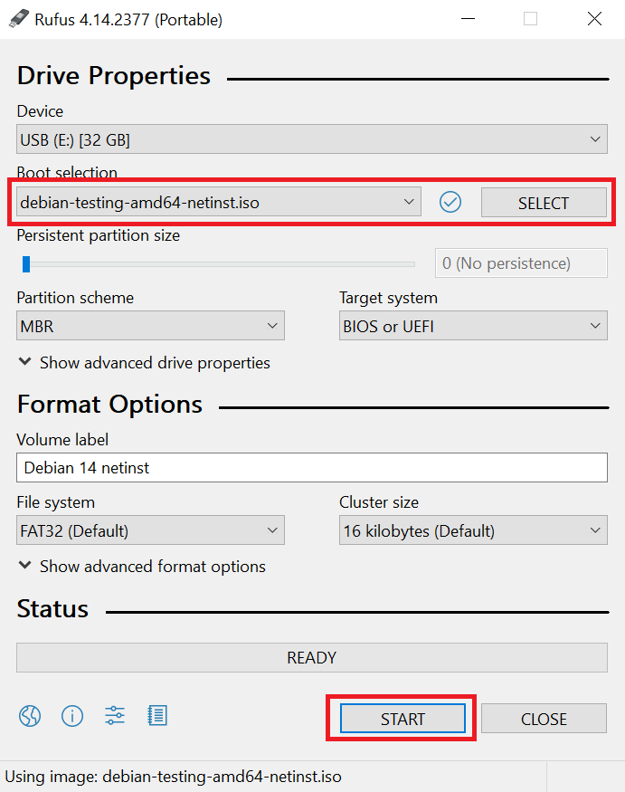
</p>
Rufus may ask you some questions before writing the image. Just click "OK" / "Confirm" to start the process.

### Install Debian on the server machine

Connect your server with RJ45 cable to the LAN router.

Put Debian installer USB disk in USB port.

Turn on the server and enter the BIOS by pressing relevant key on the keyboard. It might be something like DEL, F1, F12 - depends on the manufacturer.

In BIOS make sure that USB disk is selected as a first boot device. Make sure that virtualization is possible and is enabled for your processor.

Save all changes and restart the server. It should now boot from the USB disk and you will see a welcome screen for Debian installer.

Installation is pretty straightfoward. Just follow below video. **STOP** before GNOME installation (we don't need that).
<p align="center">
  <a href="https://www.youtube.com/watch?v=w2HFAhIIyag" target="_blank">
    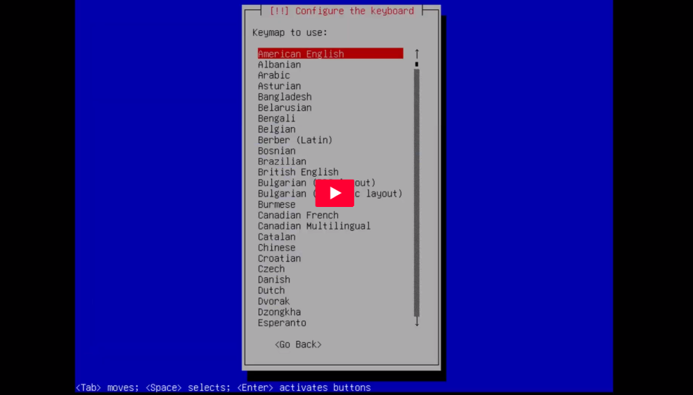
  </a>
</p>

After installation is finished remove USB disk and reboot the machine.

Now your Debian 14 server is up and running and can be used in both ways:<br>
- host OS on which you will run virtual server with Home Assistant Operating System<br>
- general purpose Linux server where you can run any additional services (pihole, file server, whatever)


## 2. Set up bridge networking on your host OS
By default Debian configures your network interface as a DHCP client, so you get a dynamic IP from your LAN router.<br>
We want to have a static IP on the server, so it can always be connected with the same IP.

Let's first install **bridge-utils** package
```bash
apt install bridge-utils
```
Now check your current IP
```bash
ip a
```
<p align="center">
    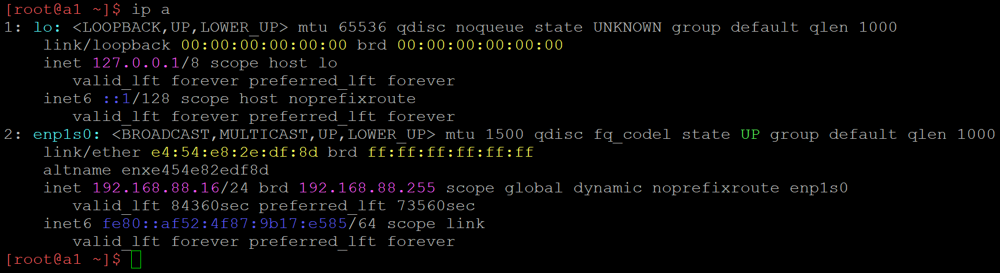
</p>

In this example we see two network interfaces: **lo** virtual loopback interface and **enp1s0** physical network card connected to LAN router with ethernet cable.<br>
Physical network interface received 192.168.88.16 IP via DHCP.<br>
Now it's time to plan what static IP we are going to use. It should be outside DHCP IP range. If you don't know it, safe bet would be to use a high number. In this example I will use **192.168.88.100**.

Let's edit interfaces configuration file
```bash
nano /etc/network/interfaces
```
This is a default view. Your interface name can be different.

<p align="center">
    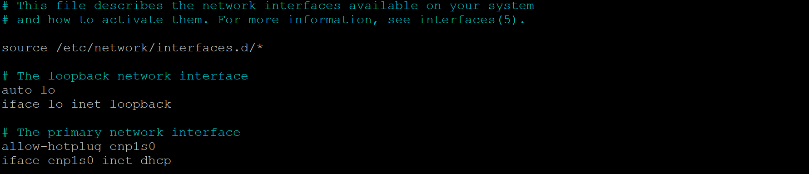
</p>

Let's define a **br0** bridge and bind a physical interface **enp1s0** as a bridge port.
```bash
# This file describes the network interfaces available on your system
# and how to activate them. For more information, see interfaces(5).

source /etc/network/interfaces.d/*

# The loopback network interface
auto lo
iface lo inet loopback

# Set up interfaces manually, avoiding conflicts with, e.g., network manager
iface enp1s0 inet manual

# The primary network interface
auto br0
iface br0 inet static
 address 192.168.88.100
 broadcast 192.168.88.255
 netmask 255.255.255.0
 gateway 192.168.88.1
 bridge_ports enp1s0
 bridge_stp off
 bridge_waitport 0
 bridge fd 0
```
Let's reboot the server.
```bash
systemctl reboot
```
Check current network status.
```bash
ip a
```
<p align="center">
    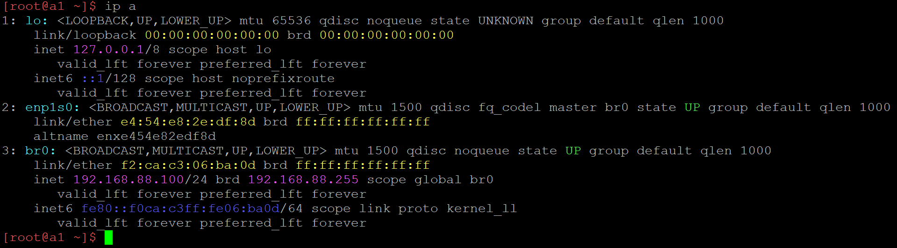
</p>

Bridge **br0** is up and static IP is assigned.

## 3. Install QEMU/KVM and set it up
Home Assistant Operating System (HAOS) can be deployed in couple different ways.<br>
It can be installed standalone on the server, but this way we get a very restriced Linux system without possibility of installing and running additional services.<br>
Therefore in this tutorial HAOS will be run as a virtual server guest in QEMU and our host server (Debian) will provide full functionality of a Linux server for running other services.

Let's install QEMU and additional packages.
```bash
apt install --no-install-recommends qemu-system-x86 libvirt-clients libvirt-daemon-system virt-install ovmf
```
HAOS virtual image is based on x86 architecture, therefore we are installing only x86 system in order to reduce installation size.

Next step is to setup network in our virtualization system.<br>
We will use **virsh** for managing guest virtual machines (properly called virtual domains).<br>
Let's start with following command:
```bash
virsh net-list --all
```
You should see this
<p align="center">
    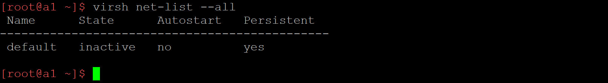
</p>
This is a **default** network. We will modify it. It will be later used by our HAOS virtual machine.<br>
It's inactive (not started) yet. Let's make it autostart.
```bash
virsh net-autostart default
```
By default this network uses NAT. We want to change it to bridge.<br>
This way it can use IP address from our LAN range and can be freely accessed within the LAN.
```bash
virsh net-edit default
```
This is a default definition for **default** network.<br>
UUID is randomly generated. It will be different on your machine.
<p align="center">
    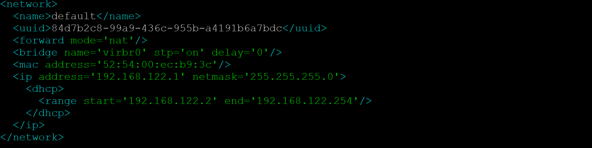
</p>
Let's change it to:
```bash
<network>
  <name>default</name>
  <uuid>PUT-YOUR-UUID-HERE</uuid>
  <forward mode='bridge'/>
  <bridge name='br0'/>
</network>
```
Now let's manually start the default network.
```bash
virsh net-start default
```
```bash
virsh net-list --all
```
<p align="center">
    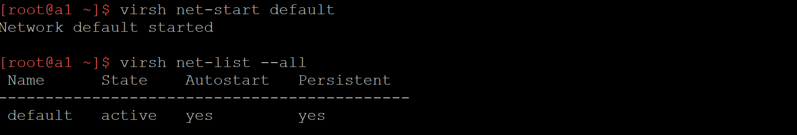
</p>
We now have a **default** network set up as a bridge. It will use our host OS bridge.<br>

## 4. Deploy and run Home Assistant Operating System on QEMU
In this step we need to download HAOS virtual image to our server.

Let's start with installing necessary packages.
```bash
apt install wget xz-utils
```
Visit [https://www.home-assistant.io/installation/linux/](https://www.home-assistant.io/installation/linux/){:target="_blank" rel="noopener"} and copy URL to the KVM (.qcow2) image. Link should be on the very top of the page.<br>
Download it with **wget** to the **/var/lib/libvirt/images/** directory.
```bash
wget -P /var/lib/libvirt/images/ https://github.com/home-assistant/operating-system/releases/download/17.3/haos_ova-17.3.qcow2.xz
```
Decompress downloaded file.
```bash
unxz /var/lib/libvirt/images/haos_ova-17.3.qcow2.xz
```
Import HAOS image with **virt-install**. You might want to change RAM and virtual CPU count as per your need.
```bash
virt-install --name haos --description "Home Assistant OS" --os-variant=generic --ram=4096 --vcpus=2 --disk /var/lib/libvirt/images/haos_ova-17.3.qcow2,bus=scsi --controller type=scsi,model=virtio-scsi --import --graphics none --boot uefi
```
HAOS virtual machine will be started.<br>
Wait until it boots (it might take a while).<br>
Log in with user **root** and no password.
<p align="center">
    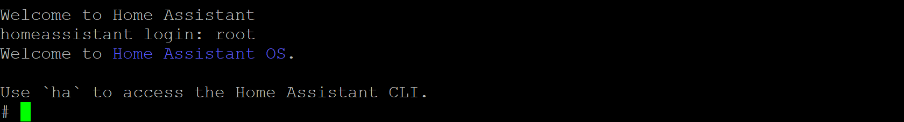
</p>
Next step is to configure network in HAOS system.<br>
Let's first display current network information.
```bash
ha network info
```
<p align="center">
    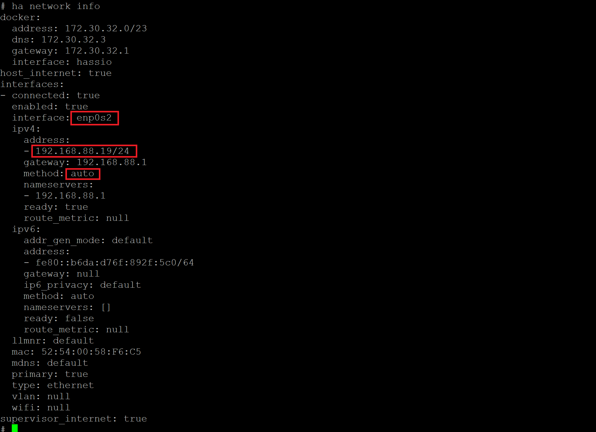
</p>
We can see that HAOS default network interface is named **enp0s2**.<br>
It got a DHCP IP from our LAN router (method: auto).<br>
We want to change it to a static IP (different than the Debian host server).<br>
In my example I'll make it **192.168.88.101**.
```bash
ha network update enp0s2 --ipv4-method static --ipv4-address 192.168.88.101/24 --ipv4-gateway 192.168.88.1
```
<p align="center">
    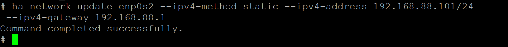
</p>
**Optional step:**<br>
Change Home Assistant hostname.<br>
By default Home Assistant can be reached with **homeassistant** hostname.<br>
I want to make it shorter. For instance just: **ha**.
```bash
hostnamectl hostname ha
```
```bash
vi /etc/hosts
```
<p align="center">
    
</p>
As for now Home Assistant Operating System configuration is finished.<br>
Execute following command:
```bash
ha banner
```
Read and note all important information from the screen.
<p align="center">
    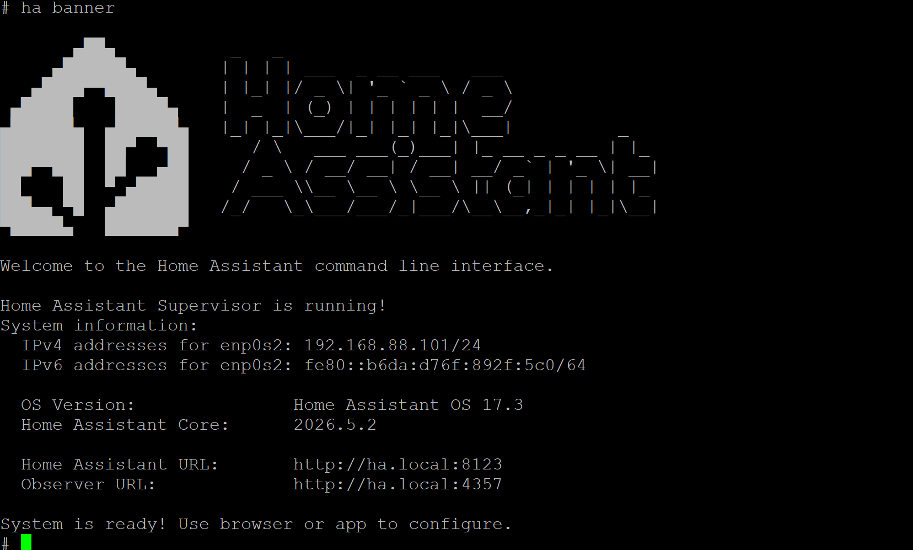
</p>
HAOS guest OS can be shut down. We will come back to Debian host OS.
```bash
shutdown -h now
```
We now have Home Assistant virtual machine (virtual domain in QEMU terminology) installed.<br>
In Debian host OS let's set it up to start automatically on server startup.
```bash
virsh autostart haos
```
Let's reboot our server and chek if everything works as expected.
```bash
shutdown -r now
```
Wait until Debian server boots up and try to access Home Assistant with it's URL:<br>
[http://ha:8123](http://ha:8123){:target="_blank" rel="noopener"}<br>
or<br>
[http://homeassistant:8123](http://homeassistant:8123){:target="_blank" rel="noopener"}<br>
if you decided not to change HAOS hostname.

You should see Home Assistant onboarding screen.
<p align="center">
    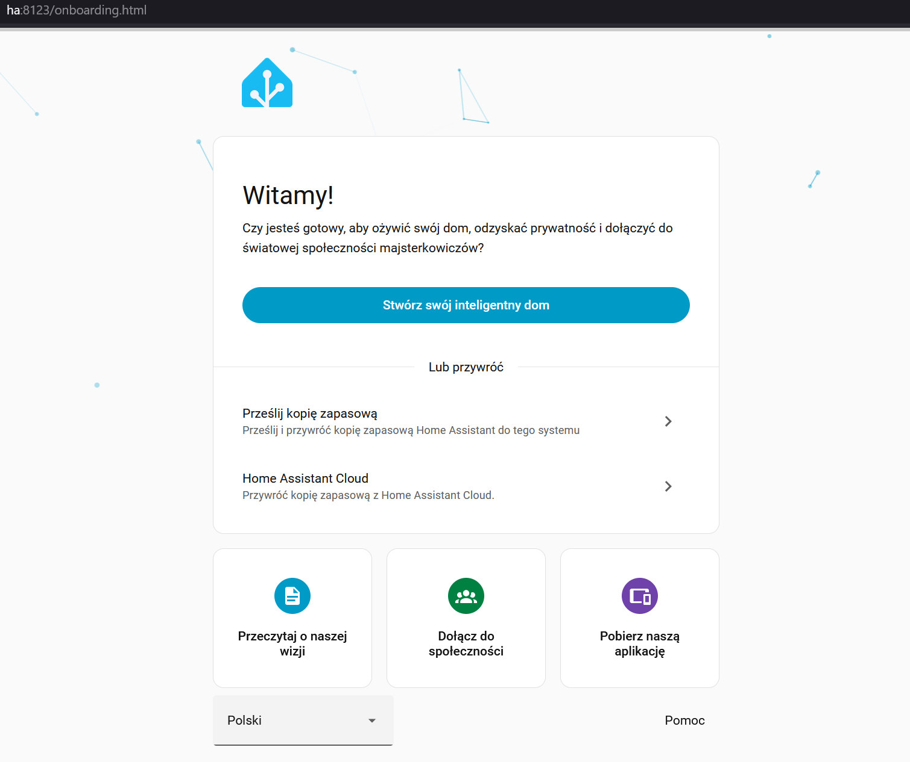
</p>
